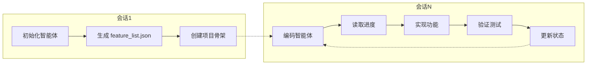
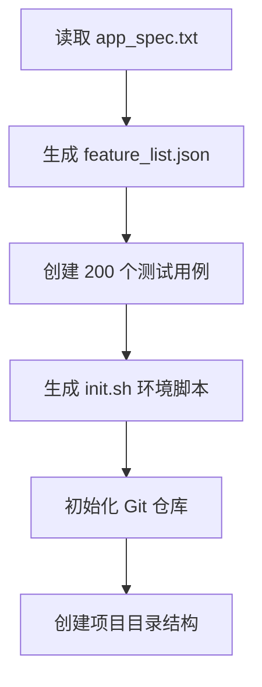
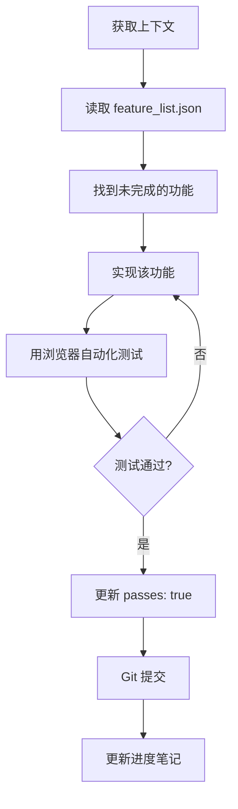
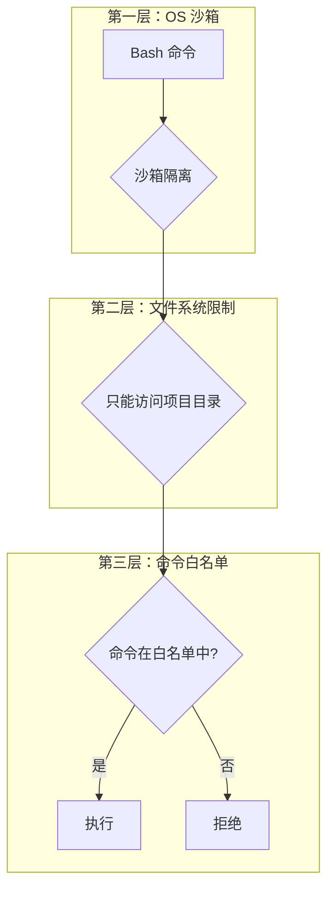
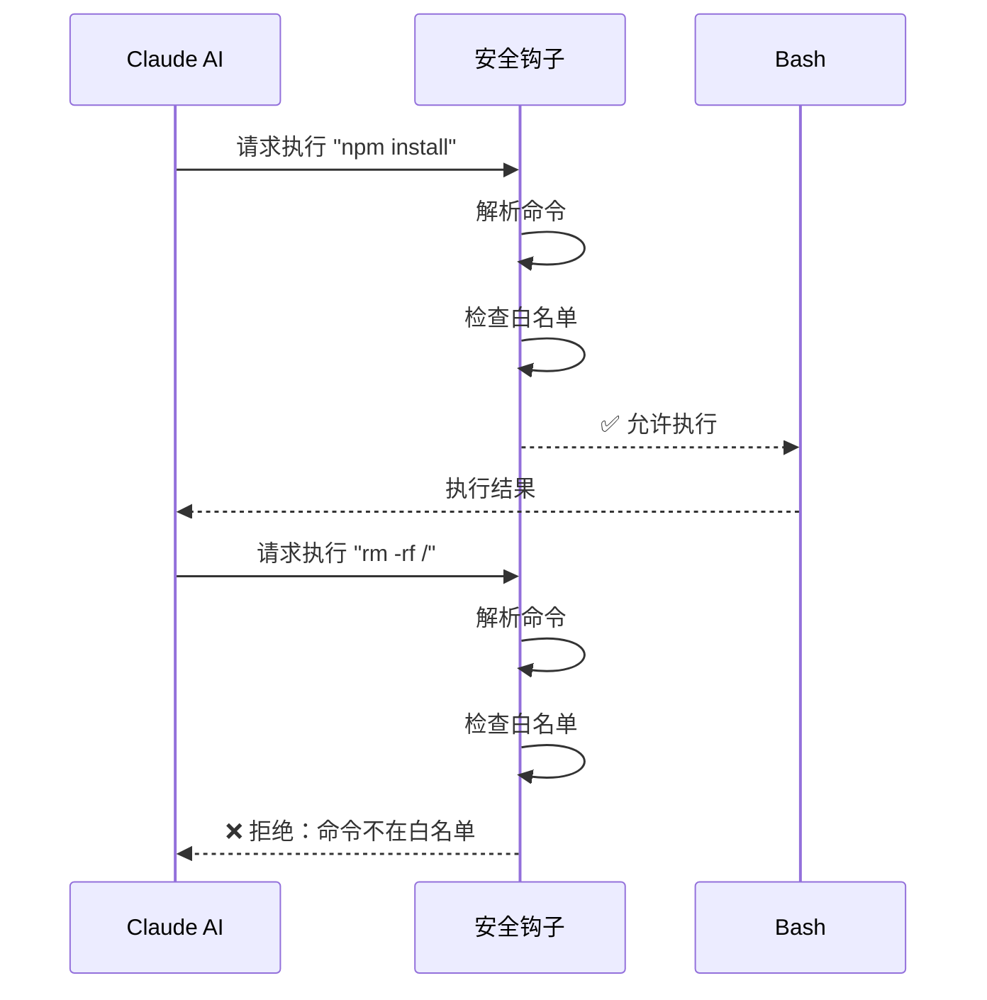
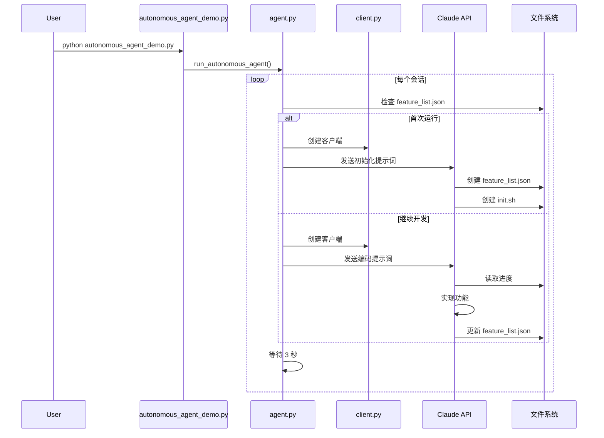
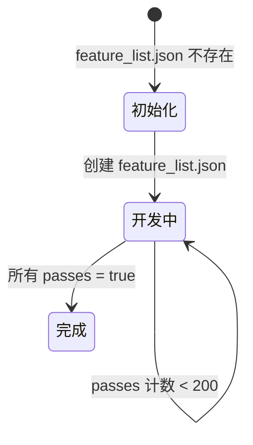

# Autonomous Coding Agent 工作原理详解

本文档深入分析 `autonomous-coding` 项目的架构设计、核心机制和工作流程，帮助读者理解如何构建一个能够**长时间自主运行**的 AI 编程智能体。

---

## 一、项目概览

### 1.1 项目定位

这是一个基于 Claude Agent SDK 的**自主编程演示框架**，能够：
- 🤖 **自主构建完整应用**：无需人工干预，持续开发
- 🔄 **跨会话连续工作**：通过状态持久化，多次会话累积进度
- 🛡️ **多层安全防护**：确保 AI 行为在受控范围内
- 📊 **进度可追踪**：通过 `feature_list.json` 精确衡量完成度

### 1.2 核心设计理念



---

## 二、项目结构

```
autonomous-coding/
├── autonomous_agent_demo.py   # 主入口：命令行解析、启动智能体
├── agent.py                   # 核心：智能体会话逻辑、循环控制
├── client.py                  # SDK 客户端配置：安全策略、权限设置
├── security.py                # 安全层：Bash 命令白名单验证
├── progress.py                # 进度追踪：测试通过率统计
├── prompts.py                 # 提示词加载：读取 prompt 模板
├── prompts/
│   ├── app_spec.txt           # 应用规格说明（构建目标）
│   ├── initializer_prompt.md  # 初始化智能体提示词
│   └── coding_prompt.md       # 编码智能体提示词
└── requirements.txt           # Python 依赖
```

---

## 三、双智能体模式（Two-Agent Pattern）

这是本项目最核心的设计模式，解决了 AI 上下文窗口有限的关键问题。

### 3.1 为什么需要双智能体？

| 挑战 | 解决方案 |
|-----|---------|
| 上下文窗口有限 | 每个会话独立，状态持久化到文件 |
| 任务太复杂一次完不成 | 分解为可累积的小任务 |
| 需要不同阶段的专业能力 | 初始化和编码使用不同提示词 |

### 3.2 初始化智能体（Session 1）

**职责**：项目规划和基础设施搭建



**关键产出**：
- **feature_list.json**：包含 200 个详细测试用例，是项目的"任务清单"
- **init.sh**：环境初始化脚本
- **项目骨架**：根据规格说明创建的目录结构

### 3.3 编码智能体（Session 2+）

**职责**：持续实现功能并验证



---

## 四、核心机制详解

### 4.1 会话管理机制

**代码位置**：[agent.py](file:///d:/dev/claude-quickstarts/autonomous-coding/agent.py)

```python
async def run_autonomous_agent(project_dir, model, max_iterations):
    """自主智能体主循环"""
    
    # 判断是首次运行还是继续
    is_first_run = not (project_dir / "feature_list.json").exists()
    
    while True:
        iteration += 1
        
        # 创建新的 SDK 客户端（全新上下文）
        client = create_client(project_dir, model)
        
        # 选择合适的提示词
        prompt = get_initializer_prompt() if is_first_run else get_coding_prompt()
        
        # 执行会话
        async with client:
            status, response = await run_agent_session(client, prompt, project_dir)
        
        # 自动继续（3秒延迟）
        await asyncio.sleep(AUTO_CONTINUE_DELAY_SECONDS)
```

**关键设计**：
1. **状态判断**：通过 `feature_list.json` 是否存在判断项目阶段
2. **全新上下文**：每次循环创建新客户端，避免上下文窗口溢出
3. **自动延续**：会话结束后自动开始下一轮，无需人工干预

### 4.2 进度持久化机制

**状态文件**：

| 文件 | 作用 |
|-----|-----|
| `feature_list.json` | 功能清单和完成状态 |
| `claude-progress.txt` | 人类可读的进度笔记 |
| Git 提交历史 | 代码变更记录 |

**feature_list.json 结构**：

```json
[
  {
    "category": "functional",
    "description": "用户可以发送消息并收到流式回复",
    "steps": [
      "Step 1: 导航到聊天页面",
      "Step 2: 在输入框输入消息",
      "Step 3: 点击发送按钮",
      "Step 4: 验证消息流式显示"
    ],
    "passes": false  // ← 唯一允许修改的字段
  }
]
```

> [!IMPORTANT]
> **黄金规则**：feature_list.json 中只能修改 `"passes"` 字段！
> 不能删除、修改描述或步骤，确保功能清单的完整性。

### 4.3 多层安全机制

**代码位置**：[client.py](file:///d:/dev/claude-quickstarts/autonomous-coding/client.py) + [security.py](file:///d:/dev/claude-quickstarts/autonomous-coding/security.py)



#### 第一层：OS 级别沙箱

```python
security_settings = {
    "sandbox": {"enabled": True, "autoAllowBashIfSandboxed": True},
    # ...
}
```

#### 第二层：文件系统限制

```python
"permissions": {
    "allow": [
        "Read(./**)",   # 只能读取项目目录
        "Write(./**)",  # 只能写入项目目录
        # ...
    ]
}
```

#### 第三层：Bash 命令白名单

```python
# security.py
ALLOWED_COMMANDS = {
    # 文件查看
    "ls", "cat", "head", "tail", "wc", "grep",
    # Node.js 开发
    "npm", "node",
    # 版本控制
    "git",
    # 进程管理（受限）
    "ps", "lsof", "sleep", "pkill",
}
```

#### 敏感命令特殊验证

```python
# pkill 只能杀死开发相关进程
def validate_pkill_command(command_string):
    allowed_process_names = {"node", "npm", "npx", "vite", "next"}
    # ... 验证逻辑

# chmod 只允许 +x（添加执行权限）
def validate_chmod_command(command_string):
    if not re.match(r"^[ugoa]*\+x$", mode):
        return False, f"chmod only allowed with +x mode"
```

### 4.4 安全钩子工作流程



---

## 五、提示词工程

### 5.1 初始化提示词核心要点

**文件**：[initializer_prompt.md](file:///d:/dev/claude-quickstarts/autonomous-coding/prompts/initializer_prompt.md)

```markdown
## YOUR ROLE - INITIALIZER AGENT (Session 1 of Many)

### CRITICAL FIRST TASK: Create feature_list.json
- Minimum 200 features total
- Both "functional" and "style" categories  
- At least 25 tests MUST have 10+ steps each
- Order features by priority: fundamental features first

### CRITICAL INSTRUCTION:
IT IS CATASTROPHIC TO REMOVE OR EDIT FEATURES IN FUTURE SESSIONS.
```

### 5.2 编码提示词核心要点

**文件**：[coding_prompt.md](file:///d:/dev/claude-quickstarts/autonomous-coding/prompts/coding_prompt.md)

```markdown
## YOUR ROLE - CODING AGENT
This is a FRESH context window - you have no memory of previous sessions.

### STEP 1: GET YOUR BEARINGS (MANDATORY)
# 1. 读取项目规格
cat app_spec.txt
# 2. 读取功能清单
cat feature_list.json | head -50
# 3. 读取进度笔记
cat claude-progress.txt

### STEP 6: VERIFY WITH BROWSER AUTOMATION
**CRITICAL:** You MUST verify features through the actual UI.
- Navigate to the app in a real browser
- Take screenshots at each step
- Verify both functionality AND visual appearance

### STEP 7: UPDATE feature_list.json (CAREFULLY!)
**YOU CAN ONLY MODIFY ONE FIELD: "passes"**
```

---

## 六、浏览器自动化测试

项目通过 MCP（Model Context Protocol）集成 Puppeteer 进行 UI 测试：

```python
# client.py
PUPPETEER_TOOLS = [
    "mcp__puppeteer__puppeteer_navigate",
    "mcp__puppeteer__puppeteer_screenshot",
    "mcp__puppeteer__puppeteer_click",
    "mcp__puppeteer__puppeteer_fill",
    # ...
]

mcp_servers={"puppeteer": {"command": "npx", "args": ["puppeteer-mcp-server"]}}
```

**测试流程**：
1. 启动开发服务器
2. 用 Puppeteer 导航到应用
3. 模拟用户交互（点击、输入）
4. 截图验证 UI 状态
5. 检查浏览器控制台错误

---

## 七、工作流程完整时序图



---

## 八、关键设计模式总结

### 8.1 状态机模式

项目状态通过文件系统隐式管理：



### 8.2 防御性编程

- **命令解析**：使用 `shlex.split()` 安全解析 shell 命令
- **失败安全**：解析失败则拒绝执行
- **白名单优先**：默认拒绝，只允许明确列出的命令

### 8.3 渐进增强

- 从基础功能开始（优先级排序）
- 每个会话只完成 1-2 个功能
- 持续验证已完成功能不退化

---

## 九、使用示例

### 9.1 启动自主开发

```bash
# 设置 API 密钥
export ANTHROPIC_API_KEY='your-key'

# 启动（无限迭代直到完成）
python autonomous_agent_demo.py --project-dir ./my_app

# 测试模式（限制迭代次数）
python autonomous_agent_demo.py --project-dir ./my_app --max-iterations 3
```

### 9.2 中断和恢复

```bash
# 按 Ctrl+C 暂停
# 再次运行相同命令即可恢复
python autonomous_agent_demo.py --project-dir ./my_app
```

### 9.3 查看进度

```bash
# 查看通过率
cat my_app/feature_list.json | grep '"passes": true' | wc -l

# 查看进度笔记
cat my_app/claude-progress.txt
```

---

## 十、总结

`autonomous-coding` 是一个精心设计的自主编程框架，其核心创新点包括：

1. **双智能体模式**：通过专门的初始化和编码智能体，优化不同阶段的工作效率
2. **状态持久化**：利用文件系统保存进度，实现跨会话连续工作
3. **多层安全**：沙箱 + 文件限制 + 命令白名单，确保 AI 行为可控
4. **测试驱动**：每个功能必须通过浏览器自动化验证才算完成
5. **提示词工程**：精心设计的提示词引导 AI 遵循最佳实践

这种设计模式为构建可信赖的长时间运行 AI 系统提供了有价值的参考。
